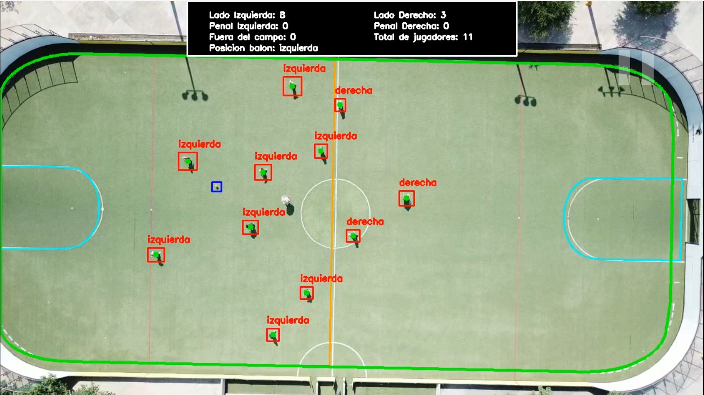

# Analítica Deportiva usando Modelos de Deep Learning

## Descripción del Proyecto

Este proyecto se enfoca en la analítica deportiva utilizando técnicas de Deep Learning y Visión por Computadora para la detección de jugadores y balón de fútbol a partir de videos aéreos.

El notebook implementa un pipeline completo de Machine Learning utilizando la arquitectura YOLOv11 del framework Ultralytics. El proyecto incluye:

* Preprocesamiento de video y extracción de fotogramas usando OpenCV
* Preparación del dataset y flujos de trabajo de anotación
* División de datos para entrenamiento, validación y pruebas
* Optimización de hiperparámetros con Optuna
* Entrenamiento del modelo usando YOLOv11
* Validación y pruebas del modelo entrenado
* Visualización de resultados de detección

El objetivo principal es desarrollar un sistema de detección de objetos capaz de identificar jugadores de fútbol y el balón en grabaciones deportivas aéreas.

---

# Clonación del proyecto:
git clone https://github.com/MauriGzz555/Proyecto-Final-IA2

cd sports-analytics-yolo

---

# Tecnologías Utilizadas

* Python 3.10+
* OpenCV
* Ultralytics YOLOv11
* Optuna
* Scikit-learn
* Google Colab
* PyTorch

---

# Ejecutar con Google Colab

1. Sube el notebook a Google Colab.
2. Sube el dataset a Google Drive.
3. Ejecuta las celdas en orden.

El notebook ya incluye integración con Google Drive.

---

# Preparación del Dataset

El proyecto espera un dataset que contenga:

* Jugadores de fútbol
* Balón de fútbol
* El video para extraer los frames
* Labels e imágenes de entrenamiento

Las imágenes deben estar anotadas en formato YOLO.

Ejemplo de anotación YOLO:

```txt
0 0.512 0.421 0.120 0.210
```

---

# Entrenamiento del Modelo

El notebook entrena el modelo YOLOv11s utilizando:

```python
from ultralytics import YOLO

model = YOLO("yolo11s.pt")
```

El flujo de trabajo incluye:

* Optimización de hiperparámetros usando Optuna
* Estrategia híbrida de entrenamiento
* Generación de métricas de validación
* Visualización de resultados

---

# Ejemplo de Salida

Después del entrenamiento, el modelo genera resultados de detección similares a los siguientes:

```txt
image 1/1
640x640 22 players, 1 ball
Speed: 4.3ms preprocess, 15.2ms inference, 2.1ms postprocess
```

Salida visual esperada:

* Bounding boxes alrededor de los jugadores
* Bounding box alrededor del balón
* Zonas importantes marcadas (Ärea de penalti, separación entre izquierda y derecha, etc.)



Ejemplo de métricas:

```txt
mAP50: 0.89
Precision: 0.91
Recall: 0.87
```


# Notas

* El notebook fue diseñado principalmente para Google Colab.
* Asegúrate de que las rutas del dataset estén correctamente configuradas antes del entrenamiento.
* Se recomienda ampliamente utilizar aceleración por GPU.